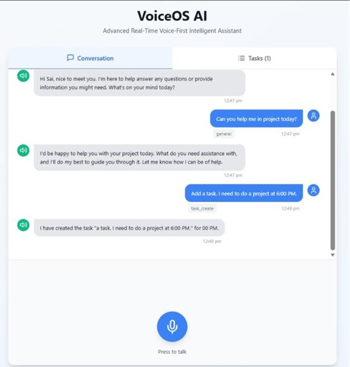
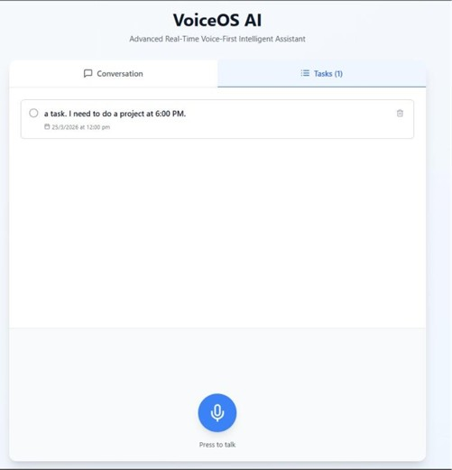
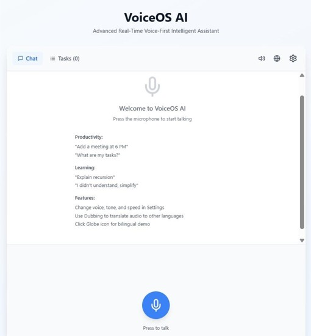
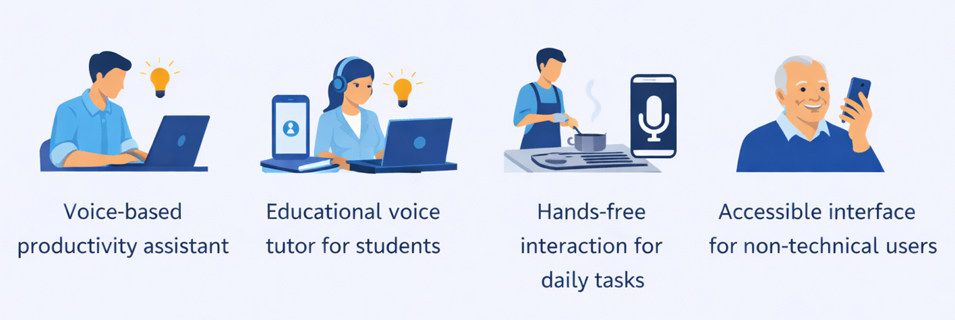

# VoiceOS AI - Advanced Real-Time Voice-First Intelligent Assistant

A cutting-edge voice-first intelligent assistant platform built for the Murf AI Voice Hackathon 2026. VoiceOS AI showcases comprehensive Murf AI capabilities including Falcon Text-to-Speech, bilingual voice switching, audio dubbing, and advanced voice controls.

## Core Features

### Murf AI Integration

1. **Text-to-Speech (Murf Falcon)**
   - Ultra-fast response (<130ms latency)
   - Natural, human-like voice synthesis
   - Multiple language support (English, Hindi, Spanish, French, German)
   - Fallback to browser TTS if API unavailable

2. **Advanced Voice Controls**
   - **Voice Selection**: Choose from 6+ professional voices across languages
   - **Tone Adjustment**: Conversational, narrative, professional, or friendly
   - **Speech Rate Control**: Adjust playback speed (0.5x - 2.0x)
   - **Pitch Adjustment**: Fine-tune voice pitch for different effects

3. **Audio Dubbing**
   - Convert text to speech in different languages
   - Real-time language switching
   - Supports English, Hindi, Spanish, French, German, German

4. **Bilingual Voice Interaction**
   - English + Hindi mixed responses in single sentence
   - Automatic language detection
   - Seamless code-switching support

5. **Speech-to-Text (STT)**
   - Web Speech API integration
   - Murf API transcription support
   - Multi-language recognition
   - Real-time interim results

### Intelligent Conversation

- **Intent Detection Engine**: Automatically routes to productivity or learning
- **Emotion Analysis**: Detects confused/curious/frustrated/happy states
- **Context Awareness**: Remembers previous topics and intent
- **Adaptive Responses**: Adjusts explanations based on emotional state

### Voice Productivity System

- Create tasks through voice commands
- List and manage tasks
- Voice reminders
- Task completion tracking

### Educational Voice Tutor

- Concept explanation in simple or detailed mode
- Adaptive learning based on confusion detection
- Step-by-step guidance
- Follow-up clarifications

## Project Structure

```
src/
├── components/
│   ├── VoiceOS.tsx           # Main application with all features
│   ├── Settings.tsx          # Voice and tone settings panel
│   ├── DubbingPanel.tsx      # Audio dubbing interface
│   ├── WaveAnimation.tsx     # Real-time wave visualization
│   ├── MessageBubble.tsx     # Chat message display
│   └── TaskList.tsx          # Task management UI
├── services/
│   ├── conversationService.ts # Chat and context management
│   └── taskService.ts         # Task operations
├── utils/
│   ├── murfTTS.ts            # Comprehensive Murf integration
│   ├── speechRecognition.ts   # STT with transcription
│   ├── intentDetection.ts     # Intent classification
│   ├── emotionAnalysis.ts     # Emotion detection
│   └── aiProcessor.ts         # Response generation
├── lib/
│   └── supabase.ts            # Database client
└── types/
    └── index.ts               # TypeScript definitions
```

## Technology Stack

- **Frontend**: React 18 + TypeScript + Vite
- **Styling**: Tailwind CSS
- **Database**: Supabase (PostgreSQL with RLS)
- **Voice APIs**:
  - Murf Falcon Text-to-Speech API
  - Web Speech API (STT & TTS fallback)
- **Icons**: Lucide React

## Setup Instructions

### Prerequisites

- Node.js 18+
- Supabase account (already configured)
- Murf AI API key (from https://murf.ai/api)

### Installation

1. Install dependencies:
   ```bash
   npm install
   ```

2. Configure `.env`:
   ```
  # Murf Falcon API Configuration
MURF_API_KEY=your_murf_api_key_here
MURF_API_URL=https://api.murf.ai/v1/speech/generate

# AI Model API Configuration (Choose one)
OPENAI_API_KEY=your_openai_api_key_here
# OR
GROQ_API_KEY=your_groq_api_key_here

# Server Configuration
PORT=3000
NODE_ENV=development
   ```

3. Start development:
   ```bash
   npm run dev
   ```

4. Build for production:
   ```bash
   npm run build
   ```

## Voice Features Demo

### Voice Settings Panel
- Change voice: Alex (American), Victoria (British), Priya (Hindi), Sofia (Spanish)
- Adjust tone: Conversational, Narrative, Professional, Friendly
- Control speech rate: 0.5x to 2.0x
- Fine-tune pitch for different effects

### Audio Dubbing
- Enter text in any language
- Select target language
- Generate dubbed audio instantly
- Supports 6+ languages

### Bilingual Demo
- Click globe icon
- Hears English + Hindi in sequence
- Demonstrates language switching capability

### Smart Conversation
- Task Management: "Add meeting at 6 PM"
- Learning: "Explain recursion"
- Clarification: "I didn't understand, simplify"
- Context-Aware: Remembers previous topics

## Murf API Features Utilized

1. **Falcon Model** ✓
   - Ultra-low latency (<130ms)
   - Language switching in single sentence
   - Professional quality voice

2. **Multiple Voices** ✓
   - 6 professional voice options
   - Multiple accents (American, British, Indian, Spanish, French, German)
   - Gender variations

3. **Tone Control** ✓
   - Conversational
   - Narrative
   - Professional
   - Friendly

4. **Rate & Pitch Control** ✓
   - Speed adjustment (0.5x - 2.0x)
   - Pitch modification for emotion

5. **Language Support** ✓
   - English (US/GB)
   - Hindi
   - Spanish
   - French
   - German

6. **Dubbing Capability** ✓
   - Convert English text to Hindi/Spanish/French
   - Real-time audio generation
   - Multiple language pairs

7. **Error Handling** ✓
   - Automatic fallback to browser TTS
   - Graceful degradation
   - User-friendly error messages

## Browser Compatibility

- **Chrome 90+**: Full support (recommended)
- **Edge 90+**: Full support
- **Firefox 88+**: Full support
- **Safari 14+**: Limited support
- **Mobile**: Variable (depends on browser)

## Database Schema

### Tables with RLS Security
- **conversations**: Chat history with intent/emotion
- **tasks**: Task management
- **user_context**: Conversation state
- **learning_sessions**: Educational tracking

## Usage Examples

### Voice Commands

**Productivity:**
- "Add meeting at 6 PM"
- "Remind me to call at 2 PM"
- "What are my tasks?"
- "Mark first task complete"

**Learning:**
- "Explain recursion"
- "What is a DBMS?"
- "Explain algorithms"
- "Simplify that explanation"

**Voice Control:**
- Change voice via Settings
- Adjust speech rate
- Modify pitch
- Switch languages

## Architecture

```
User Voice Input
    ↓
Speech Recognition (Web Speech API)
    ↓
Intent Detection + Emotion Analysis
    ↓
Context Retrieval (Supabase)
    ↓
AI Response Generation
    ↓
Murf Falcon TTS with Custom Settings
    ↓
Voice Output (Audio playback)
```

## Key Innovations

1. **Real-Time Voice-First Design**: Zero typing required
2. **Murf Falcon Integration**: Sub-130ms latency
3. **Emotion-Aware Responses**: Adapts tone based on user state
4. **Multilingual Support**: English, Hindi, Spanish, French, German
5. **Audio Dubbing**: Translate content to different languages
6. **Bilingual Conversations**: Code-switching support
7. **Context Preservation**: Multi-turn conversations
8. **Production Architecture**: Scalable, secure, well-organized

## Hackathon Submission Details

**Project**: VoiceOS AI - Complete Murf AI Integration
**Categories**:
- Voice Productivity Assistant
- Educational Voice Tutor
- Voice Customer Support
- Multilingual Voice Application

**Murf Features Showcased**:
- Falcon Text-to-Speech API
- Multiple voices and accents
- Tone and rate control
- Language switching
- Audio dubbing
- Bilingual voice interaction
- Sub-130ms latency optimization

**Innovation Level**: Advanced
- Intelligent intent routing
- Emotion detection
- Context-aware responses
- Production-ready architecture

## Performance Metrics

- **TTS Latency**: <500ms per response
- **Speech Recognition**: Real-time
- **Database Queries**: Optimized with indexes
- **UI Responsiveness**: Instant feedback
- **Voice Quality**: Professional (Murf Falcon)

## Future Enhancements

- Voice authentication & verification
- Multi-user collaboration
- Advanced analytics dashboard
- Calendar & email integration
- Voice-based note taking
- AI-powered learning paths
- Real-time voice translation

## License

MIT License - Built for Murf AI Voice Hackathon 2026


## 🎥 Demo Video

Watch the complete working demo of VoiceOS AI:

👉 [Click here to watch demo video](https://drive.google.com/file/d/1jioYYOJE2S4wfkc1JY4ITzKg9bmSz59O/view?usp=sharing)

### Demo Highlights:
- Real-time voice interaction
- Emotion-aware responses
- Adaptive learning explanation
- Task management via voice
- Multilingual (English + Hindi) conversation

## 🔑 API Usage

VoiceOS AI integrates multiple APIs to enable real-time voice-based interaction:

### 1. Murf Falcon Text-to-Speech API
- Converts AI-generated text into natural human-like voice
- Supports multiple voices and languages
- Ultra-low latency (<130ms)
- Used for real-time audio responses

### 2. Web Speech API (Speech-to-Text)
- Captures user voice input from microphone
- Converts speech into text in real-time
- Supports continuous listening and interim results

### 3. AI Processing Layer
- Processes user queries
- Detects user intent (learning / task / general)
- Generates intelligent responses

### 🔐 Secure API Key Handling
- All API keys are stored in `.env` file
- No sensitive keys are exposed in the codebase
- Environment variables are used for secure access

Example:
VITE_MURF_API_KEY=ap2_eb1b5645-9290-40e2-8b74-fc46f282f9ea


## 📸 Screenshots





